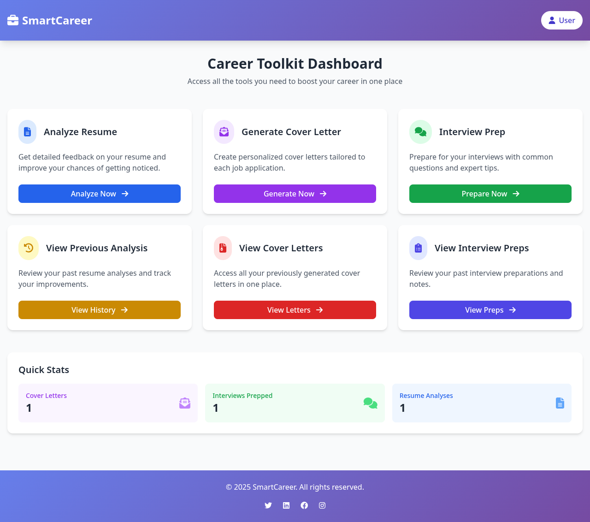
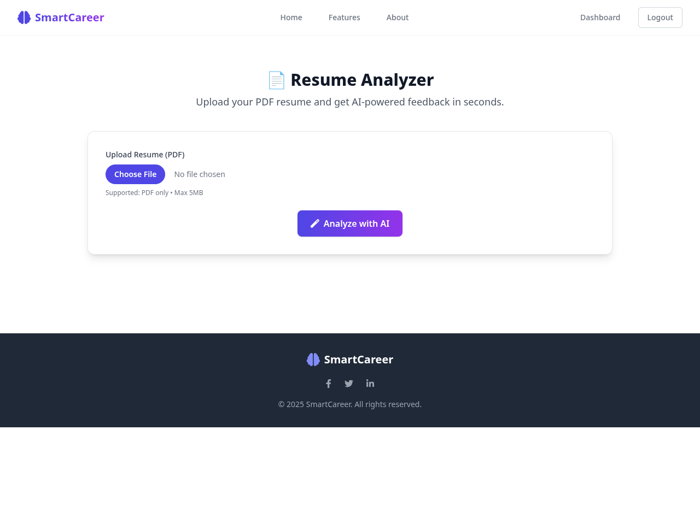
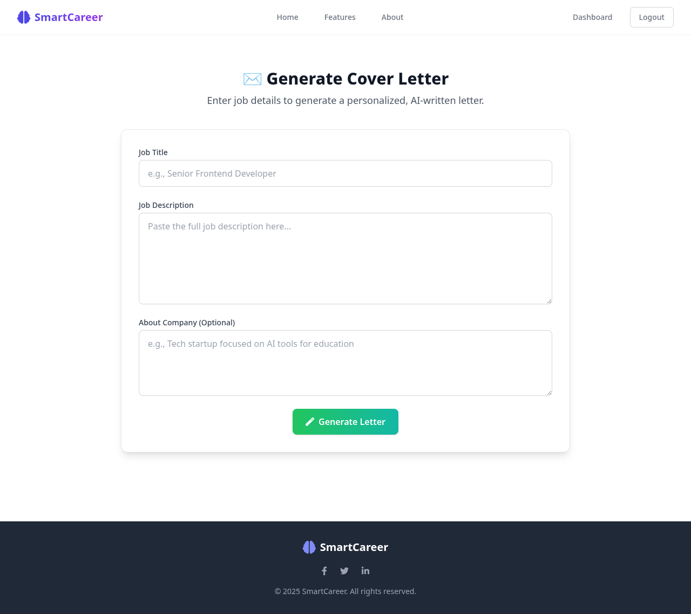
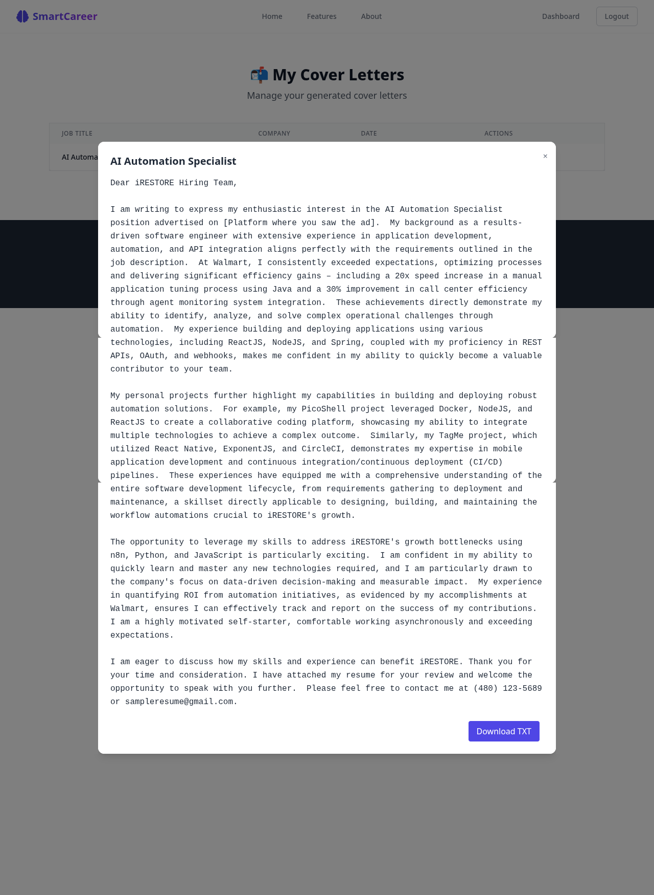
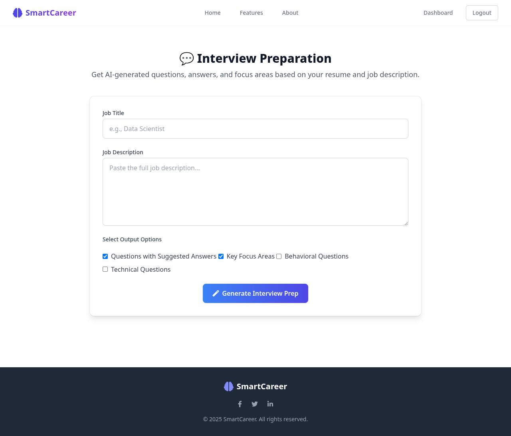
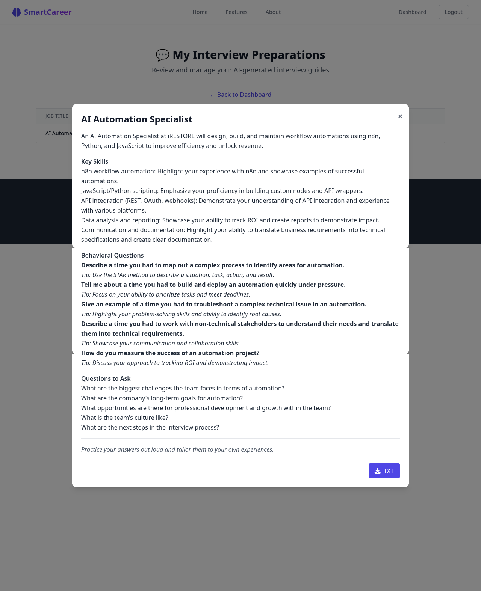

Absolutely! Below is a **beautiful `README.md`** file for your **SmartCareer** AI-powered career toolkit. It includes:

✅ Professional structure  
✅ All 7 screenshots from `/images`  
✅ Detailed description for each image  
✅ App overview, features, and tech stack  
✅ Ready to use in GitHub or documentation

---

### ✅ `README.md`

```markdown
# SmartCareer — AI-Powered Career Toolkit



**SmartCareer** is an intelligent web application that helps job seekers **analyze resumes**, **generate personalized cover letters**, and **prepare for interviews** using the power of AI (Google Gemini). Built with **Flask, Tailwind CSS, and SQLAlchemy**, it offers a sleek, modern interface and a seamless user experience.

Whether you're applying for your first job or advancing your career, SmartCareer gives you the tools to stand out in a competitive market.

---

## 🚀 Features

- **📄 Resume Analyzer**  
  Upload your PDF resume and get AI-powered feedback on ATS score, key skills, strengths, missing sections, and improvement suggestions.

- **✉️ Cover Letter Generator**  
  Generate personalized, professional cover letters based on your resume and job description.

- **💬 Interview Preparation**  
  Get AI-generated behavioral and technical questions, focus areas, and tips tailored to your profile.

- **📊 View & Manage History**  
  Access all your past analyses, cover letters, and interview prep sessions in one place.

- **💾 Secure & Persistent**  
  All data is stored in a database and associated with your user account.

---

## 🖼️ App Screenshots & Walkthrough

### 1. Dashboard


The **dashboard** is your central hub. It features a clean, modern design with gradient header and hover animations. From here, you can navigate to all tools and view quick stats like number of cover letters and interview preps.

---

### 2. Analyze Resume


Upload your resume (PDF) and click **"Analyze with AI"**. The app extracts text using `pdfplumber` and sends it to **Google Gemini** for analysis.

> 💡 **Loading animation** appears while the AI processes your resume.

---

### 3. View Resume Analysis Result


After analysis, you’re redirected to a detailed results page showing:
- ATS Compatibility Score (with visual bar)
- Key Skills (as badges)
- Strengths and missing sections
- Actionable improvement suggestions

All data is saved to the database for future reference.

---

### 4. Cover Letter Generator


Enter the **job title**, **job description**, and optional **company info**. The AI generates a personalized cover letter using your resume.

> ✍️ No page refresh — powered by **AJAX and background processing**.

---

### 5. View Generated Cover Letter


The generated cover letter is displayed in a clean, professional layout. You can:
- **Download as TXT**
- **Download as PDF**
- **Review before sending**

All generated letters are saved and can be accessed later.

---

### 6. Interview Preparation


Choose your **job title**, **job description**, and output options (e.g., questions with answers, focus areas). The AI generates a structured prep guide.

> ⏳ Loading animation ensures smooth UX during AI processing.

---

### 7. View Generated Interview Prep


The prep guide is displayed in a well-organized format with:
- Key skills to highlight
- Behavioral questions with tips
- Questions to ask the interviewer

You can download it or review it anytime from the history page.

---

## 🛠️ Tech Stack

| Layer | Technology |
|------|------------|
| **Frontend** | HTML, Tailwind CSS, Font Awesome, JavaScript (AJAX) |
| **Backend** | Python, Flask, Flask-Login, Flask-WTF |
| **Database** | SQLite (with SQLAlchemy ORM) |
| **AI Engine** | Google Gemini API (`gemini-1.5-flash`) |
| **PDF Processing** | `pdfplumber` |
| **Styling** | Tailwind CSS (via CDN) |
| **Deployment Ready** | Yes (can be deployed on Render, Vercel, or AWS)

---

## 📁 Project Structure

```
smart-career-app/
├── app.py                  # Main Flask app
├── models.py               # Database models (User, Resume, CoverLetter, InterviewPrep, etc.)
├── forms.py                # WTForms for user input
├── utils/
│   ├── pdf_parser.py       # Extract text from PDF
│   └── gemini_client.py    # Call Google Gemini API
├── templates/
│   ├── base.html           # Base template with Tailwind
│   ├── dashboard.html      # Dashboard with cards
│   ├── resume_analysis.html
│   ├── cover_letter.html
│   ├── interview_prep.html
│   ├── view_analysis.html
│   ├── view_cover_letters.html
│   └── view_interview_preps.html
├── static/
│   └── style.css           # Optional custom styles
├── images/                 # Screenshots (1.png to 7.png)
├── uploads/                # User-uploaded resumes
├── instance/               # Database (smartcareer.db)
├── config.py
├── .env                    # GEMINI_API_KEY
└── README.md
```

---

## 🔐 Setup & Installation

1. **Clone the repo**
   ```bash
   git clone https://github.com/yourusername/smart-career-app.git
   cd smart-career-app
   ```

2. **Create virtual environment**
   ```bash
   python -m venv venv
   source venv/bin/activate  # Linux/Mac
   venv\Scripts\activate     # Windows
   ```

3. **Install dependencies**
   ```bash
   pip install -r requirements.txt
   ```

4. **Set up environment variables**
   Create `.env`:
   ```env
   GEMINI_API_KEY=your_gemini_api_key_here
   SECRET_KEY=your_flask_secret_key
   ```

5. **Run the app**
   ```bash
   python app.py
   ```

6. **Open in browser**
   → [http://127.0.0.1:5000](http://127.0.0.1:5000)

---

## 🌐 Future Enhancements

- [ ] Dark mode toggle
- [ ] Export all data as PDF report
- [ ] Support for `.docx` resumes
- [ ] Voice-based mock interview practice
- [ ] Deploy to **Render.com** with PostgreSQL

---

## 🙌 Contributing

Contributions are welcome! Feel free to open issues or pull requests for new features, bug fixes, or UI improvements.

---

## 📄 License

This project is licensed under the MIT License.

---

> ✨ **SmartCareer** – Your AI Career Coach.  
> Built with ❤️ and Python.
```

---
